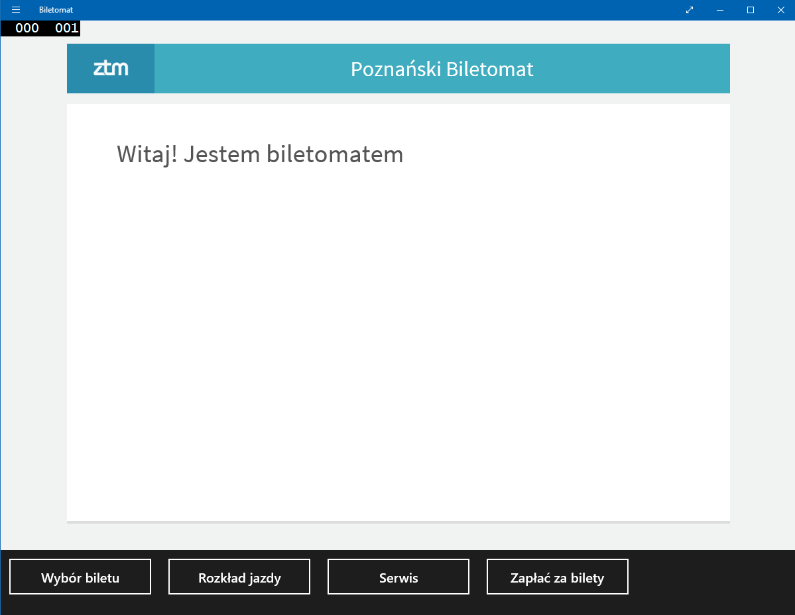

# OAD-Ticket-Machine
Ticket Machine (based on Poznan ZTM) with system design and analytic. Created at the University as the project within Object-oriented Analysis and Design classes in 2014. The purpose of this project was to try create parts of system in different technologies by every member of the team and collect into one single working app. Also to learn how to think of design and analyze systems or apps.

## App
This app allows to simulate interaction between user and ticket machine (like passenger information, choosing and paying for tickets, looking at timetable, service mode) based on Poznań Public Transport's. Every part of the system was created by another member of team in various technologies. Major part of the app is can be use by [web_app](web_app). But the finall app was [integrated](integrated_app) into C# app.

### Screenshots
  Screenshots examples. For more see [screenshots](screenshots) folder.

     
  
### Diagrams
[Diagrams](diagrams) folder contains diagrams (communications, sequence, classes) of hypothetical ticket machine system. Those types of diagrams are used in Object-oriented Analysis and Design.

### Use cases
[Use cases](use_cases) folder contains use cases of hypothetical ticket machine system. Use cases are basic tools used in Object-oriented Analysis and Design.
